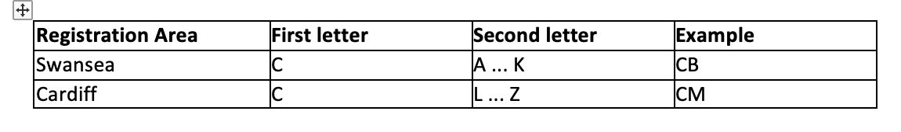
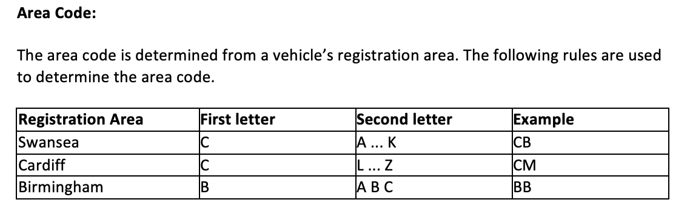
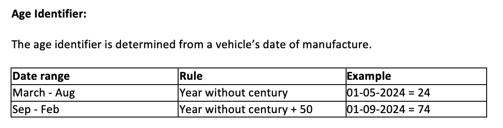

## Requirements

## Example registration number: CA 12 ABC 

##### Rules:
- CA (Pulled from Area Code) 
- 12 (Pulled from date of manufacture)
- ABC (Randomly generated string)

## Area codes for licences

For Birmingham, can do something like this - %w[A B C].sample

For Swansea, can do something like this - ('A'...'K').sample (Or a regex in that area)

For Cardiff, can do something like this - ('L'...'Z').sample (Or a regex in that area)

Letters not allowed - %w[I, K, M, Y]

## Age Identifier

## Assumptions

- I can remove any reference to the make vin as they aren't used to define the registration numbers
- Nice to have - output a hash, with reg, make, and vin

- As set out in question 3 - I assume when I don't have an area code - I can't determine the reg, this means that I can determine an invalid reg without trying to build one
- 31054 pieces of invalid data to create reg numbers

You will need to author code which performs the following functions:

1.	For each vehicle in the dataset, generate a valid Vehicle Registration Number using the rules defined above.  
2.	Output the following information:
a.	Total number of registration numbers generated.
- In theory - this should be simple, load all reg numbers into an array and just do a .count on the array
b.	Total number of registration numbers generated per registration area - Here is the difficult one
3. Were there any vehicles where the Vehicle Registration Number could not be determined? If so, how many? 
   - I am happy with what I have done for requirement 3

#### Timeline of work
- Friday - ensure you can build licence plates
- Saturday-Sunday - Implement features

